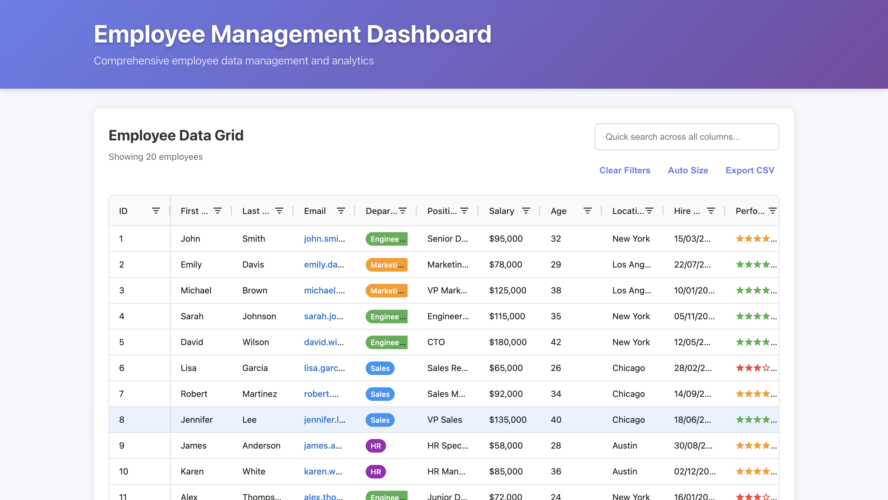
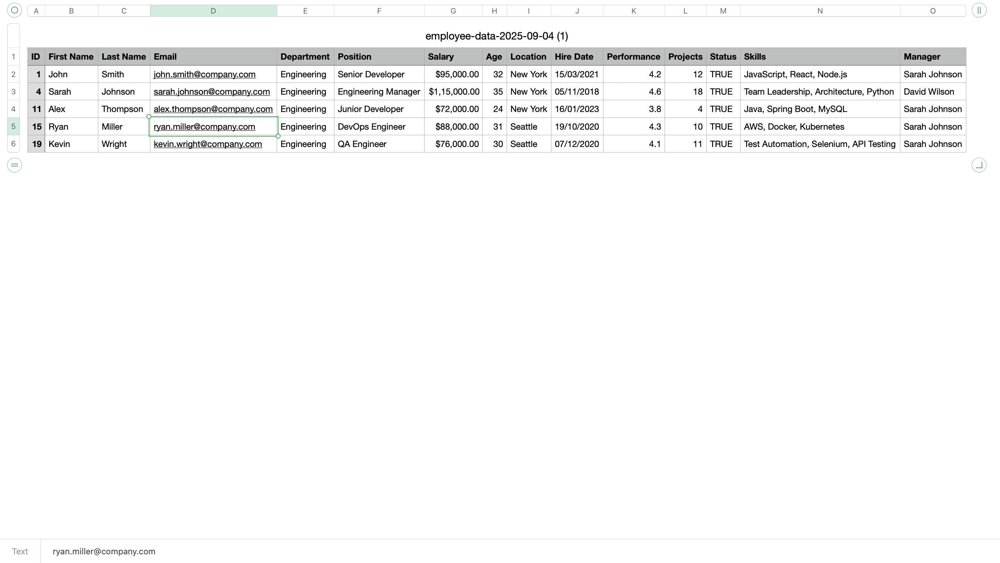
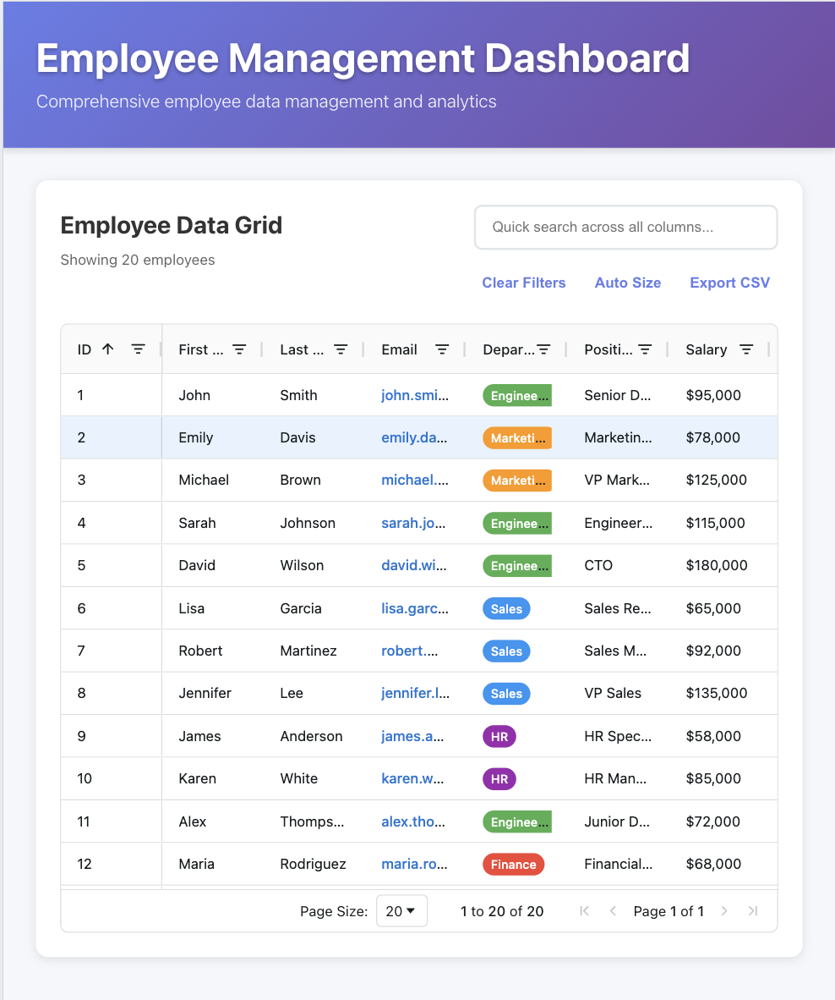
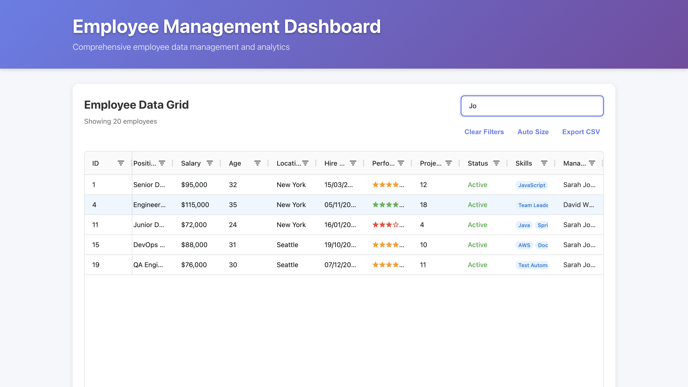

# AG Grid Dashboard - FactWise Assignment

A robust and scalable employee management dashboard built with AG Grid and React, designed to handle large datasets efficiently with professional UI/UX.

## 📋 Assignment Requirements

**FactWise Frontend Dashboard Assignment:**

- ✅ Create a dashboard displaying tabular data using AG Grid in React (client-side rendering)
- ✅ Use the sample dataset (20 employee records)
- ✅ Robust and scalable functionality for large datasets
- ✅ Clean and professional layout
- ✅ Creative implementation with advanced features

## 🛠️ Tech Stack

- **Frontend Framework:** React 18 with TypeScript
- **Build Tool:** Vite
- **Data Grid:** AG Grid Community (v34.1.2)
- **Styling:** CSS3 with modern design patterns
- **Module System:** ES6 with proper TypeScript types

## ✨ Key Features

### 🎯 Core Functionality

- **Professional Employee Data Grid** with 20+ employee records
- **Real-time Search** across all columns with instant filtering
- **Advanced Pagination** (10, 20, 50, 100 rows per page)
- **Multi-column Sorting** with visual indicators
- **Row Selection** (single/multiple) with selection counter
- **CSV Export** with timestamped filenames

### 🔧 Advanced AG Grid Features

- **Side Panels:** Column management and advanced filtering
- **Tool Panels:** Columns, Filters with full customization
- **Status Bar:** Row counts, selection stats, and aggregations
- **Auto-sizing Columns** with manual resize support

### 🎨 Professional UI/UX

- **Modern Gradient Header** with company branding
- **Responsive Design** for desktop and mobile devices
- **Custom Cell Renderers:**
  - 🏢 Department badges with color coding
  - 📧 Clickable email links
  - ⭐ Star-based performance ratings
  - 🏷️ Skill tags with modern styling
  - ✅ Status indicators (Active/Inactive)
  - 👤 Manager hierarchy display

### ⚡ Performance Optimizations

- **Row Virtualization** for handling large datasets
- **Column Virtualization** for wide tables
- **Efficient Re-rendering** with React.memo and useMemo
- **Optimized Event Handlers** with useCallback
- **Lazy Loading** cell renderers
- **Memory-efficient** data structures

### 📊 Data Management

- **Quick Filter** across all columns simultaneously
- **Advanced Column Filters** (text, number, date, set filters)
- **Filter State Management** with clear/reset functionality
- **Cell Text Selection** for easy copy-paste
- **Animated Rows** for smooth user interactions

## 📁 Project Structure

```
src/
├── components/
│   ├── DashboardHeader.tsx        # Professional header component
│   ├── StatisticsCards.tsx        # Data summary cards
│   └── EmployeeDashboard/
│       ├── index.tsx              # Main dashboard component
│       ├── employeeData.ts        # Sample dataset (20 employees)
│       ├── service.ts             # Column definitions & config
│       └── CellRenderer/          # Custom cell renderers
│           ├── index.tsx          # Barrel exports
│           ├── Department.tsx     # Department badges
│           ├── Email.tsx          # Email links
│           ├── Performance.tsx    # Star ratings
│           ├── Skills.tsx         # Skill tags
│           ├── Status.tsx         # Active/Inactive status
│           └── Manager.tsx        # Manager display
├── App.tsx                        # Main app component
├── App.css                        # Professional styling
└── main.tsx                       # App entry point with AG Grid modules
```

## 🚀 Getting Started

### Prerequisites

- Node.js 16+
- npm or yarn

### Installation

1. **Clone the repository**

   ```bash
   git clone https://github.com/Alihasan15/AG_Grid_Dashboard.git
   cd AG_Grid_Dashboard
   ```

2. **Install dependencies**

   ```bash
   npm install
   ```

3. **Start development server**

   ```bash
   npm run dev
   ```

4. **Open browser**
   ```
   http://localhost:5173
   ```

### Build for Production

```bash
npm run build
npm run preview
```

## 📸 Screenshots

### Dashboard Overview


_Professional employee management dashboard with modern UI_

### Data Export


_CSV export functionality with timestamped files_

### Mobile Responsive


_Fully responsive design for mobile devices_

### Search & Filter


_Real-time search across all columns with instant results_

## 🏆 Assignment Completion

### ✅ Requirements Met

1. **Dashboard with AG Grid:** ✅ Professional implementation
2. **React Client-side:** ✅ Pure React with TypeScript
3. **Sample Dataset:** ✅ 20 comprehensive employee records
4. **Large Dataset Handling:** ✅ Virtualization, pagination, efficient filtering
5. **Clean & Professional:** ✅ Modern UI with responsive design
6. **Creative Features:** ✅ Advanced AG Grid features, custom renderers

### 🚀 Beyond Requirements

- **Enterprise-level features** (side panels, tool panels, status bar)
- **Performance optimizations** for scalability
- **TypeScript implementation** for type safety
- **Custom cell renderers** for enhanced data visualization
- **Export functionality** for data analysis
- **Mobile-responsive design** for cross-device usage

## 👨‍💻 Developer

**Ali Hasan Mulji**

- GitHub: [@Alihasan15](https://github.com/Alihasan15)
- Email: alihasanmulji@gmail.com
